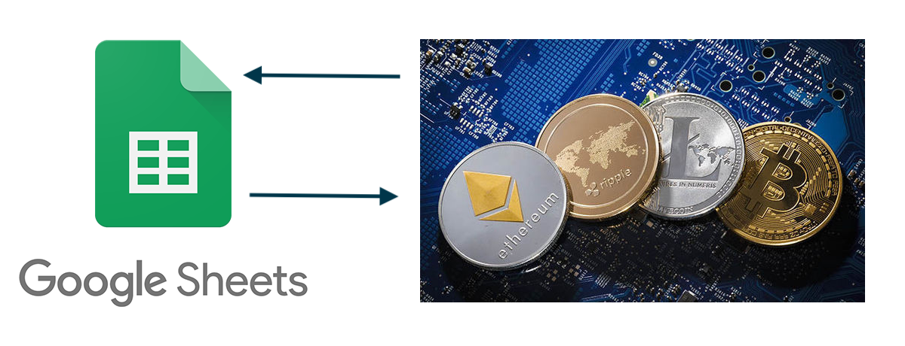
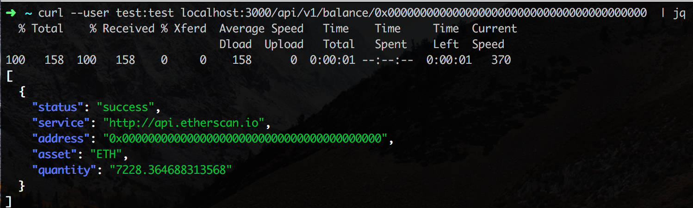
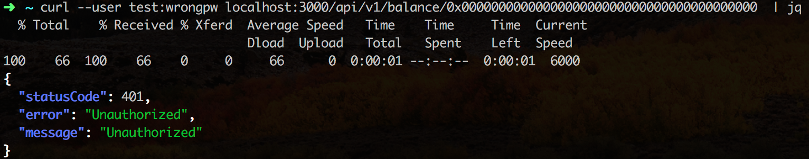

# ⚡ serverless-crypto-balances

A serverless backend to query crypto wallet balances

[](./architecture.png)

## Details

To find out more about how it works, check out my medium post: [https://medium.com/@kvaggelakos/serverless-part-2-61ad3986371f](https://medium.com/@kvaggelakos/serverless-part-2-61ad3986371f)


## Running

### Prerequisites

1. Make sure you're aws keys are set up in `~/.aws/credentials`
2. Make sure you have serveless installed.

```
npm install -g serverless
```

3. Also don't forget to:

```
npm install
```

## Deployment

In order to run create the stack in AWS run:

```
sls deploy -v
```

## Tear down

To clean up run:

```
sls remove
```

## Using from google spreadsheet

In order to use this from your google spreadsheet, check out the script [here](./spreadsheet-code/walletbalance.gs)


## Screenshots

[](./architecture.png)
[](./architecture.png)


## Built With

* [Serverless](https://github.com/serverless/serverless) - The Serverless Framework
* [crypto-balances](https://github.com/litvintech/crypto-balances/) - A node module for checking balances

## Contributing

All contributions are welcome. Make a pull request wiihooo 🤠

## Authors

* **Kostas Vaggelakos**

## License

This project is licensed under the MIT License - see the [LICENSE.md](LICENSE.md) file for details